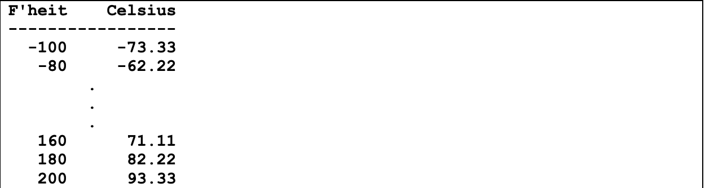
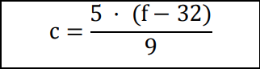

# Konvertierung Celsius ↔ Fahrenheit
## Aufgabe
Schreiben Sie ein Programm in C, welches für die Temperaturwerte von -100 bis +200 Grad
Fahrenheit (in 20er Schritten) die entsprechenden Werte in Celsius ausgibt. Die Ausgabe soll
in einer sauber formatierten Tabelle analog zum folgenden Beispiel erscheinen (Celsius auf
zwei Stellen gerundet, vier Leerzeichen zwischen F‘heit und Celsius):

## Hinweise
* Die Formel für die Umrechnung von Fahrenheit (f) in Celsius (c) Werte lautet:

* Für die Aufgabe brauchen Sie eine Schleife und die `printf`-Funktion. Siehe die verschiedenen Praktika Aufgaben wo `printf` verwendet und teilweise erklärt wird.