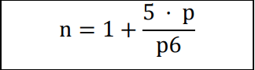

# Notenstatistik
## Aufgabe
Schreiben Sie ein C-Programm, welches es einem Dozenten ermöglicht, die Notenstatistik zu
einer Prüfung zu erstellen. In einem ersten Schritt sollen dabei die Punktzahlen, die die einzelnen Studenten erzielt haben, eingegeben und in einem Array gespeichert werden. Wählen
Sie dazu den Array genügend gross (z.B. 100 Elemente). Ist diese Eingabe abgeschlossen,
wird die minimale Punktzahl eingegeben, welche für die Note 6 notwendig ist. Danach berechnet das Programm die Notenstatistik, welche in etwa folgendermassen aussehen soll:
```
--------------------------------------------------------
Statistics (20 students, 19 points needed for mark 6):

    Mark 6: 2
    Mark 5: 7
    Mark 4: 7
    Mark 3: 4
    Mark 2: 0
    Mark 1: 0
    Best mark: 6
    Worst mark: 3
    Average mark: 4.35
    Mark >= 4: 16 students (80.00 %)
--------------------------------------------------------
```

Ist diese Statistik ausgegeben worden, soll der Benutzer jeweils gefragt werden, ob er das
Programm beenden oder eine neue Notenstatistik für die eine andere minimale Punktzahl für
die Note 6 eingeben will. Im zweiten Fall wird der Benutzer nach dieser minimalen Punktzahl
gefragt und das Programm gibt die neue Notenstatistik aus.

## Hinweise
- Geben Sie die erreichten Punkte der Studenten einzeln ein, so dass das Programm
immer eine Punktzahl einliest und dann nach der nächsten fragt. Nehmen Sie an, dass
Punkte immer ganzzahlig und ≥ 0 sind. Die Eingabe einer Punktzahl “ –1“ soll die Eingabe der Punkte komplettieren; alle anderen negativen Punktzahlen sollen in einer Fehlermeldung resultieren.
- Noten seien ebenfalls ganzzahlig; 6 ist die beste und 1 die schlechteste Note. Ist p6
die Anzahl Punkte, die für eine 6 nötig sind und p die Anzahl Punkte, die ein Student
erreicht hat, dann wird seine Note n wie folgt berechnet.
Noten werden auf eine ganzzahlige Note gerundet, wobei ≥ x.5 aufgerundet wird (z.B.
gibt 4.4 die Note 4, 4.5 die Note 5):



- Zum Auf- oder Abrunden gibt es zwei Funktionen in der C Standard Library, die Sie bei
Bedarf verwenden können. Die Funktionen werden mit #include <math.h> eingebunden: 
```
double ceil(double n); // gibt den kleinsten ganzzahligen Wert ≥ n zurück
double floor(double n); // gibt den grössten ganzzahligen Wert ≤ n zurück
```
- Achten Sie auf eine übersichtliche Programmstruktur und verwenden Sie Funktionen, wo dies sinnvoll ist. Mit z.B. `funktionsname(int a[], int len)` können Sie einen `int`-Array `a` einer Funktion als Parameter übergeben. Weil ein Array seine Länge nicht kennt, ist es oft zweckmässig, zu jedem Array einen weiteren Parameter (hier
`len`) zu übergeben, der dessen Länge spezifiziert.
- Wenn Sie Mühe haben, eine eigene Programmstruktur zu finden, ist hier eine Möglichkeit angegeben. Natürlich gibt es eine Vielzahl von anderen, guten Möglichkeiten.
  - In der `main`-Funktion werden zuerst die Punktzahlen eingegeben (bis durch -1 abgeschlossen), anschliessend die nötige Punktzahl für eine Note 6.
  - Die Notenliste und die Punktzahl für eine 6 werden einer Funktion `getStatistics` übergeben, welche sämtliche Werte für die auszugebende Statistik berechnet. Diese Werte sollen mittels einer geeigneten Struktur von der Funktion zurückgegeben werden. Die Struktur selbst soll unter anderem einen Array enthalten, der angibt, wie viel Mal jede Note vorgekommen.
  - Das Berechnen der Note aus einer Punktzahl und der nötigen Punktzahl für eine 6 soll in einer Funktion `getMark` durchgeführt werden. Diese Funktion wird von `getStatistics` verwendet.