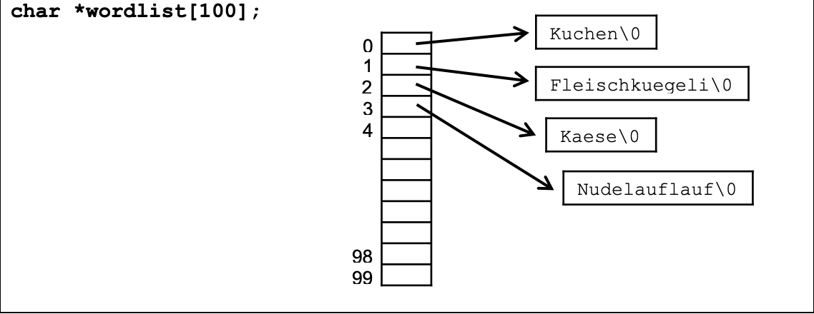

# Wörter sortieren
## Aufgabe
Schreiben Sie ein C-Programm, das eine Anzahl Wörter von der Tastatur einliest, diese in
einem Array ablegt und zum Schluss alle Wörter alphabetisch sortiert ausgibt. Wiederholt eingegebene Wörter sollen dabei ignoriert werden. Das Ende der Eingabe werde durch die Eingabe von „ZZZ“ markiert, d.h. danach werden die Wörter ausgegeben.

## Hinweise
-  Lesen Sie jeweils ein Wort von der Tastatur in einen genügend grossen char-Array mit Namen word ein (z.B. 20 Zeichen). Dieser Array wird für das Einlesen aller Wörter wieder verwendet. Speichern Sie dann das eingelesene Wort in einem Array mit Namen wordlist ab, der alle eingelesenen Wörter enthält. Diesen Array sollten Sie dazu als Array von Pointern auf char deklarieren. Der Einfachheit halber können Sie den Array mit fix vorgegebener Grösse (100 ist eine sinnvolle Vorgabe, dadurch kann der Array 100 Wörter aufnehmen) statisch deklarieren, z.B.:



- Weil beim Einlesen des nächsten Wortes in word das vorhergehende Wort überschrieben wird, müssen Sie das eingelesene Wort in einen neu erzeugten Array kopieren. Dazu sollen Sie mit malloc dynamisch einen Array erzeugen, der gerade genügend gross ist, um dieses Wort aufzunehmen (inklusive Abschlusszeichen \0). Kopieren Sie dann das Wort in den soeben erzeugten Array und schreiben Sie die Adresse dieses Arrays an die nächste freie Position in wordlist. Nach dem Einfügen von vier
Wörtern kann die Liste z.B. so aussehen wie im Bild oben.
Anmerkung: wenn Sie denken, dass all dies mit einem 2-dimensionalen Array
[100][20] viel einfacher als mit einem Array von Pointern wäre, dann haben Sie im
ersten Moment nicht unrecht: Sie könnten dann die Wörter direkt von der Tastatur an
die richtigen Positionen im Array einlesen, und zwar ohne dynamische Allozierung von
Speicher und dem Kopieren von Wörtern. Allerdings verschwenden Sie dann bei jedem Wort, das weniger als 19 Zeichen hat, einige Bytes, denn Sie haben 100 * 20 =
2000 Bytes fix alloziert. Der entscheidende Vorteil der Pointer wie im obigen Bild zeigt
sich aber erst beim Sortieren: Mit Pointern müssen Sie nur die Pointer in der wordlist umkopieren, während Sie bei einem 2-dimensionalen Array immer alle Zeichen
der Wörter kopieren müssen. Letzteres ist viel ineffizienter.
- Sortieren Sie die Wörter im Array, nachdem Sie alle Wörter eingelesen haben.
- Verwenden Sie die String-Funktionen der C Standard Library (include
<string.h>), um die Länge von Strings zu bestimmen, Strings alphabetisch zu vergleichen und Strings zu kopieren. Siehe man strlen.
- Wenn Sie aus anderen Vorlesungen bereits einen effizienten Sortieralgorithmus kennen, können Sie diesen natürlich verwenden. Sonst erfinden Sie einfach einen eigenen
Algorithmus. Er muss nicht besonders effizient sein, denn Sie geben nur eine relativ
kleine Zahl von Wörtern ein.
- Strukturieren Sie das Programm durch geeignete Funktionen. Lesen Sie die Wörter
zum Beispiel in der main-Funktion in wordlist ein und verwenden Sie jeweils eine
Funktion, um das eingelesene Wort in wordlist abzuspeichern. Anschliessend verwenden Sie eine Funktion, um die Wörter zu sortieren und eine weitere Funktion, um
die Wörter in sortierter Reihenfolge auszugeben.
- Um Speicher dynamisch zu allozieren seht die Funktion malloc (stdlib.h) zur Verfügung.
```
…
size_t n = strlen(word);
char *entry = malloc(…); // n+1 bytes, including end-of-string: \0
strcpy(…,…);
…
```