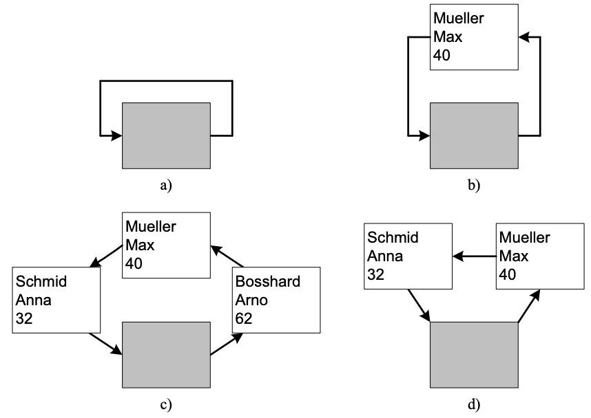

# Personenverwaltung
## Aufgabe

Schreiben Sie ein C-Programm, welches eine einfache Personenverwaltung implementiert.
Die Daten einer Person sind durch die folgende Struktur definiert:
```
typedef struct {
 char name[20];
 char firstname[20];
 unsigned age;
} Person;
```
In einer Schleife soll das Programm dem Benutzer jeweils folgende Auswahl bieten, wovon
eine Aktion mit Eingabe des entsprechenden Buchstabens ausgelöst wird:

```
I(nsert), R(emove), S(how), C(lear), E(nd):
```

- Insert: der Benutzer wird aufgefordert, eine Person einzugeben
- Remove: der Benutzer wird aufgefordert, die Daten einer zu löschenden Person einzugeben
- Show: eine komplette Liste aller gespeicherten Personen wird in alphabetischer Reihenfolge ausgegeben
- Clear: alle Personen werden gelöscht
- End: das Programm wird beendet

Da wir zur Kompilierzeit nicht wissen, ob 10 oder 10'000 Personen eingegeben werden, wäre
es keine gute Idee, im Programm einen statischen Array mit z.B. 10'000 Personen-Einträgen
zu allozieren. Dies wäre ineffizient und bietet zudem grosse Probleme beim sortierten Einfügen von Personen (siehe unten). In solchen Situation arbeitet man deshalb mit dynamischen
Datenstrukturen, die zur Laufzeit beliebig (solange Speicher vorhanden ist) wachsen und wieder schrumpfen können. Eine sehr populäre dynamische Datenstruktur ist die verkettete Liste
und genau die werden wir in diesem Praktikum verwenden (hier eine zyklische und mit einem
Sentinel Knoten).

Eine verkettete Liste bedeutet, dass ein Element der Liste einen Datensatz einer Person speichert und zusätzlich einen Pointer auf das nächste Element in der Liste aufweist (siehe Abbildung 1). In dieser Pointervariablen (next in der Struktur unten) steht also einfach die Adresse
des nächsten Listenelements. Das letzte Element in der Liste soll wieder auf das erste zeigen,
die Liste bildet also einen Kreis. Eine Person kann zugefügt werden, indem dynamisch ein neues Listenelement erzeugt wird und dies in die verkettete Liste eingefügt wird. Beim Einfügen müssen die Adressen der Listenelemente so den Pointern zugewiesen werden, dass
nachher wieder ein vollständiger Kreis besteht. Ein Element wird entfernt, indem der Speicher
des entsprechenden Listenelements freigegeben und das vorhergehende und nachfolgende
Listenelement wieder richtig verknüpft werden, so dass der Kreis wieder geschlossen ist.

Exkurs: Design Decision: Derjenige welcher diese Aufgabe definiert hat, hat entschieden
dass die Verkettete Liste zyklisch ist, d.h. am Ende wieder auf des erste Element zeigt (es
könnte auch nicht-zyklisch sein so dass das letzte Element auf NULL zeigen würde), und dass
die leere Liste ein Sentinel Element enthält (so dass man beim Einfügen/Entfernen immer ein
gültiges Element als Partner hat). Man käme auch ohne diese beiden Attribute aus (mit entsprechenden Konsequenzen). Eine Design Decision ist eine Wahl aus vielen möglichen.

Ein einzelnes Listenelement ist durch folgende Struktur definiert:

```
typedef struct LE ListElement; // ListElement anstelle von struct LE verwendbar.
struct LE {
 Person content; // In diesem Listenelement gespeicherte Person.
 ListElement *next; // Pointer auf das nächstfolgende Element in der Liste.
};
```

Die leere Liste besteht aus einem einzelnen Element, welches keine spezifische Person abspeichert und welches auf sich selbst zeigt (Abbildung 1a). Dieses Element ist der Einstiegspunkt (auch Anker genannt) der Liste und ist das einzige Element, das Sie im Programm direkt
kennen und einer Variablen zuweisen. Dieses Element können Sie statisch allozieren (z.B.
ListElement le;), denn es existiert während der gesamten Ausführungszeit. Alle anderen
Elemente erreichen Sie ausgehend vom Anker, indem Sie einmal, den Pointern folgend, im
Kreis herum gehen. Abbildung 1b zeigt die Liste nach dem Einfügen der Person Max Mueller, 40 Jahre. Nach dem Einfügen von zwei weiteren Personen sieht die Datenstruktur aus
wie in Abbildung 1c. Das Entfernen der Person Arno Bosshard führt zu Abbildung 1d.



## Hinweise
- Fügen Sie die Elemente alphabetisch aufsteigend in die Liste ein, wobei zuerst der
Name, dann der Vorname und dann das Alter verglichen werden. Meier Max kommt
also vor Meier Moritz und Mueller Peter, 40 Jahre vor Mueller Peter, 50
Jahre. Dadurch können Sie bei der Ausgabe der Elemente ganz einfach die Personen
in der Reihenfolge ausgeben, in welcher sie in der Liste sind.
- Teilen Sie das Programm auf mehrere Dateien auf. Zum Beispiel list.h und list.c
um die ListElement-Struktur zu definieren und die entsprechenden Funktionen auf
der Liste (insert, remove, show, clear) zu deklarieren und zu definieren; person.h und
person.c um dasselbe für die Person-Struktur und Funktionen auf Personen (zum
Beispiel den alphabetischen Vergleich zweier Personen) zu tun; und main.c für das
eigentliche Hauptprogramm. Schreiben Sie ebenfalls ein Makefile.
- Achten Sie darauf, allozierten Speicher wieder korrekt freizugeben, wenn Personen
aus der Liste entfernt werden.